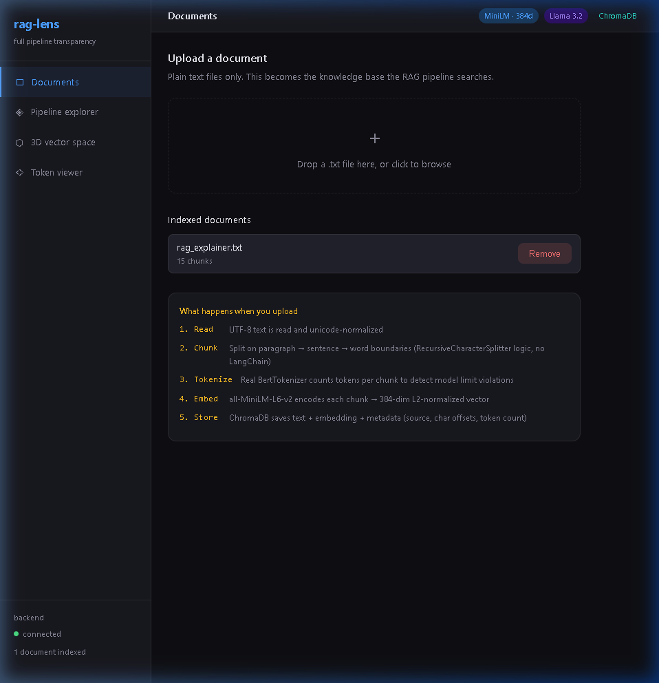
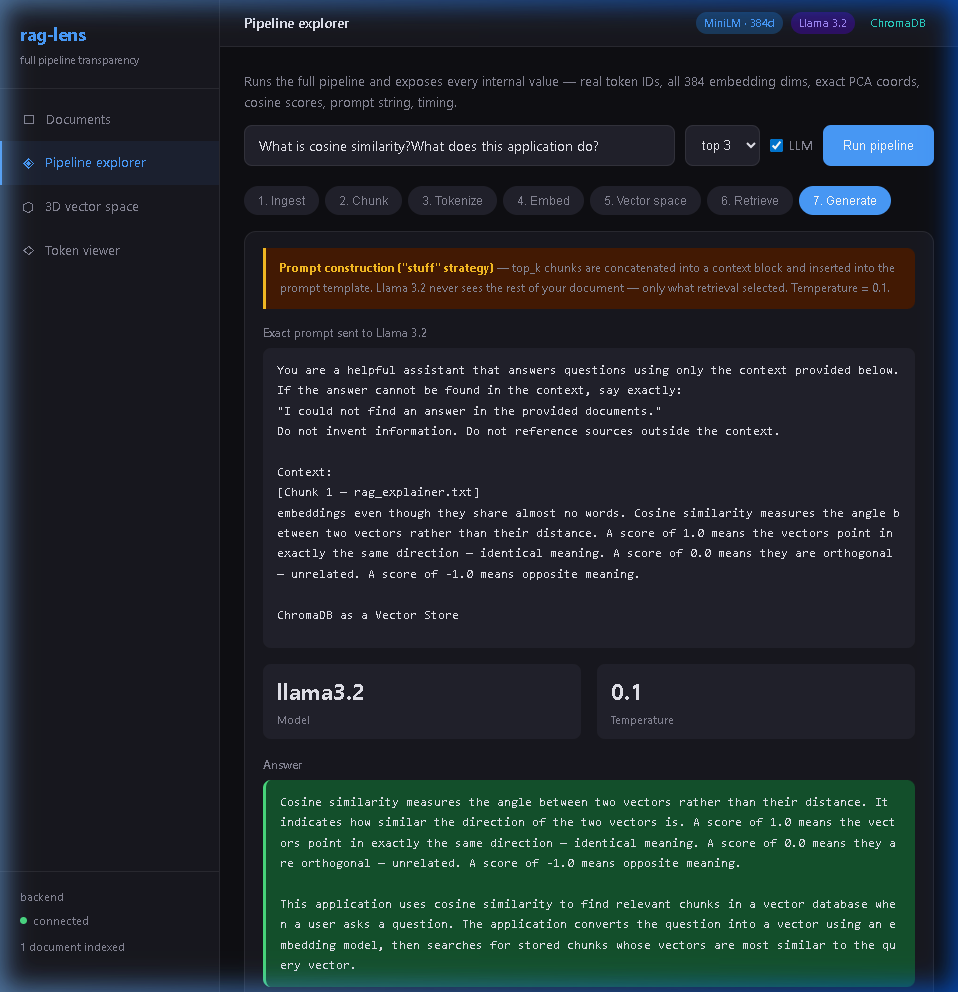
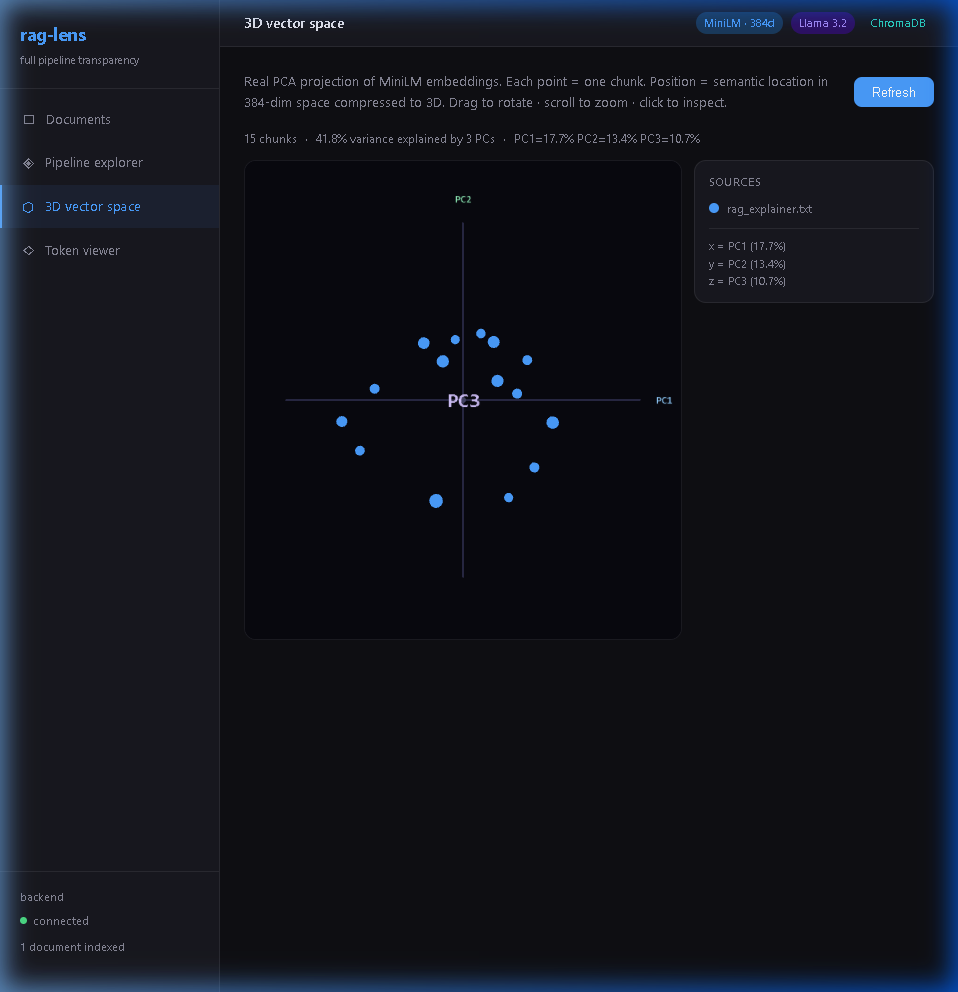
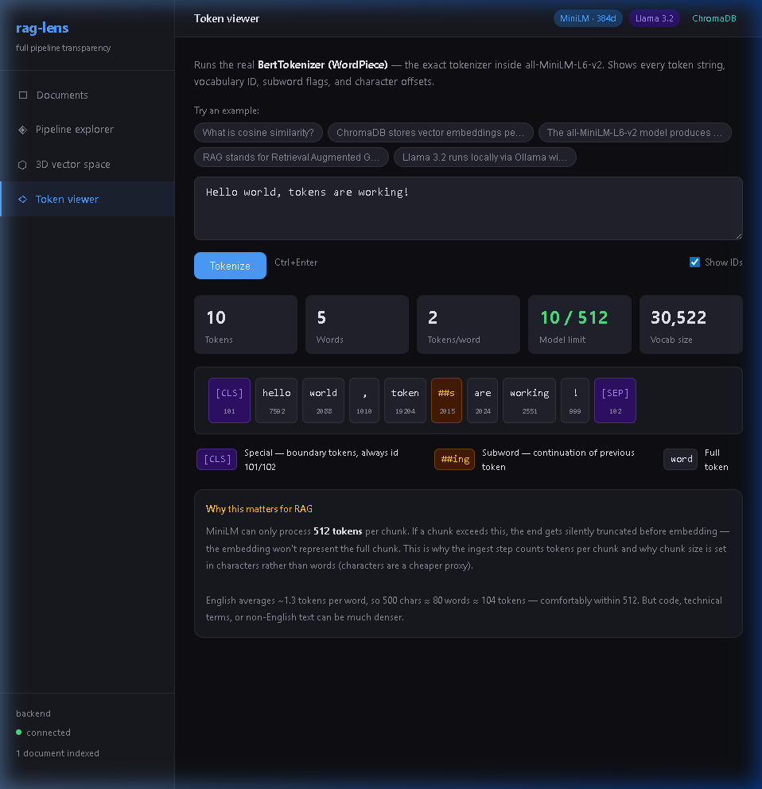
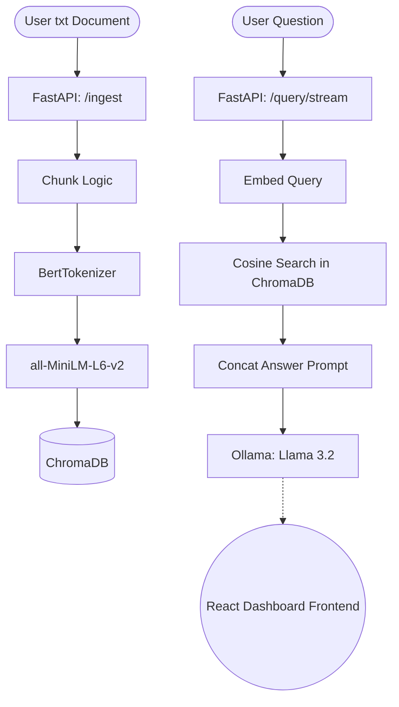

<div align="center">
  <h1>🔍 RAG Lens</h1>
  <p><strong>A full-transparency, abstraction-free Retrieval-Augmented Generation (RAG) explainer tool.</strong></p>

  [](https://github.com/subramanyapuneeth530/rag-lens/actions/workflows/ci.yml)
  [](https://python.org)
  [](https://reactjs.org/)
  [](https://fastapi.tiangolo.com/)
  [](https://ollama.com/)
  [](LICENSE)
</div>

---

## 🎯 Intention & Concept

Most modern AI frameworks (like LangChain or LlamaIndex) hide the complexity of RAG systems behind abstraction layers. While powerful, this makes it incredibly difficult for developers to learn exactly *how* their data is tokenized, embedded, stored, and sent to LLMs.

**RAG Lens** exists to solve this. It is a fully explicit pipeline. Upload a `.txt` file, ask a question, and see absolutely every internal value the system computes in real time:
- Real token IDs from **BertTokenizer**.
- All 384 **MiniLM** embedding dimensions.
- Actual **PCA coordinates** projected onto a 3D Canvas.
- True **cosine similarity scores** directly from ChromaDB.
- The exact prompt string formatting constructed and dynamically sent to **Llama 3.2**.

No black boxes. No abstracted chains. Just data transparency.

---

## ✨ Features & Interface

### 1. Document Ingestion
Start by uploading simple plain-text knowledge. The backend normalizes the text through UTF-8 encoding, segments items into precise paragraphs and words (without external abstraction logic), and actively displays backend connectivity statuses. 

<div align="center">
  
</div>

### 2. Pipeline Explorer
See exactly what goes on under the hood during a real RAG query. Ask questions against your uploaded context and watch the UI output every mathematical processing stage spanning: Chunking -> Tokenization -> Embeddding -> Vector search -> Semantic matching -> Generation.

<div align="center">
  
</div>

### 3. 3D Vector Space
Curious how text similarities are measured? RAG Lens calculates Principal Component Analysis (PCA) against the 384-dimension knowledge vectors on the backend, compressing them down to `x,y,z` coordinates to map relationships explicitly on a Three.js interactive plot.

<div align="center">
  
</div>

### 4. Interactive Token Viewer
Witness what the AI understands text to be. A fully integrated interactive viewer leveraging backend implementations of `transformers` allowing real-time character boundary offsets visualization.

<div align="center">
  
</div>


---

## 🏗️ Technical Architecture & Frameworks

### Core Stack
| Layer | Framework/Library | Role Details (Direct Usage) |
|---|---|---|
| **Embeddings** | `sentence-transformers` | Executes `.encode()` returning raw multi-dimensional numpy arrays directly without middle-men. |
| **Tokenizer** | `transformers` | Exposing real Hugging Face `BertTokenizer` IDs, subword flags, and coordinate alignments. |
| **Vector DB** | `chromadb` | Using the native raw python client to retrieve chunk distance limits. |
| **Dimensionality Reduction** | `sklearn` PCA | Standardized transformations measuring specific explained variances across queries. |
| **LLM** | `ollama` | Interacting efficiently with localized LLMs (`llama3.2`) executing fully streamed responses on SSE. |
| **Backend** | `FastAPI` | Asynchronous high-throughput gateway. |
| **Frontend** | `React` + `Vite` + `Three.js` | Fast SPA dynamically visualizing JSON metrics and WebGL scatterplots. |

### RAG Workflow Diagram


---

## 💻 Local Setup Guide

Follow these steps to run **RAG Lens** locally on your machine.

### Prerequisites
- Python 3.11+
- Node.js LTS (v20+)
- [Ollama](https://ollama.com/) running locally.

### Step 1: Initialize Local LLM Environment
Before starting servers, ensure Ollama has the correct targeted LLM locally downloaded (~2GB).
```bash
ollama serve   # Make sure the application is active
ollama pull llama3.2
```

### Step 2: Backend Setup
Create your dedicated Python virtual environment, install local ML pipelines, and start the FastAPI node.
```bash
cd backend
python -m venv .venv

# Activate (Windows)
.venv\Scripts\activate

# Activate (macOS/Linux)
source .venv/bin/activate

pip install -r requirements.txt
cp ../.env.example .env

# Run FastAPI Server
uvicorn main:app --reload --port 8000
```
> The API will be accessible via `http://localhost:8000` and Swagger UI located at `/docs`.

### Step 3: Frontend Setup
In a new terminal window, boot the interactive graphical interface.
```bash
cd frontend
npm install
npm run dev
```

> **You're all set!** Navigate natively to `http://localhost:5173/` in your browser. Upload knowledge text and explore how Artificial Intelligence perceives information.

---

## 🔌 API Reference Highlights
You can hit the backend endpoints explicitly from any REST client if you want to test RAG pipelines programmatically.

| Method | Endpoint | Return Objective |
|---|---|---|
| `POST` | `/ingest` | Upload `.txt` file, processes chunks, returns index metrics. |
| `POST` | `/query/stream` | Server-Sent-Events (SSE) chunk streaming retrieving dynamic strings live. |
| `POST` | `/debug/pipeline` | Primary diagnostic endpoint returning full coordinate, PCA, similarity, and vector breakdowns of a query against existing databases. |
| `GET`  | `/debug/embeddings` | Maps all static vector embeddings independent of inferences for Graphing tools. |

---

<p align="center">Built for analytical understanding. Released under the <b>MIT License</b>.</p>
